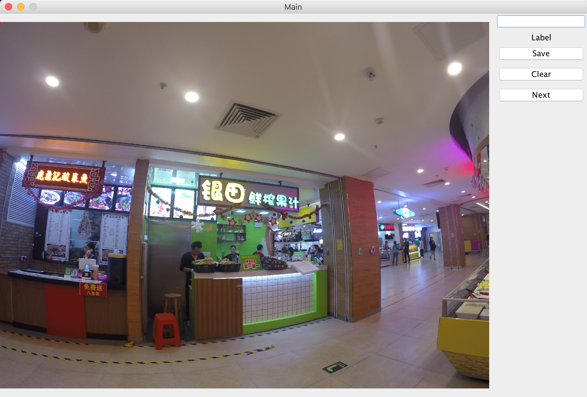
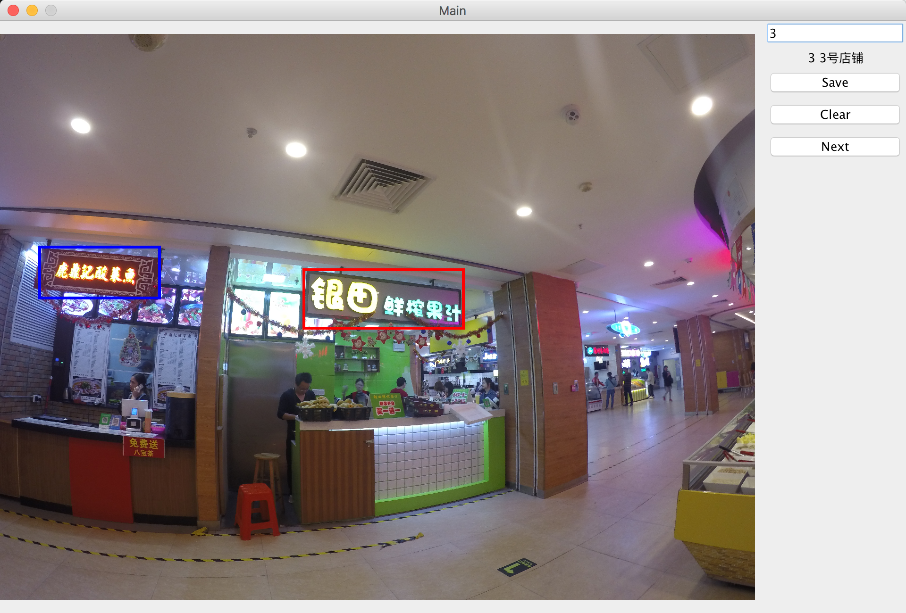

## 照片标注程序使用说明

> Created By Mingkuan At 2017-04-17

- *可以直接执行系统脚本的方式运行程序**

```shell
#shell 打开照片标注程序
java -jar TagTools.jar samples/temp.jpg samples/output.txt samples/landmark_list.txt

#C++调用系统命令
system(command)

#Java调用系统命令
Process process = Runtime.getRuntime.exec(command);
process.waitFor();
```



- 其中三个参数的含义分别是：

| parameters |          samples          |   meanings   |
| :--------: | :-----------------------: | :----------: |
|   arg[0]   |     samples/temp.jpg      | 需要标注的图片或者视频帧 |
|   arg[1]   |    samples/output.txt     |   标注的结果文件    |
|   arg[2]   | samples/landmark_list.txt | 店铺序号与名字对应的列表 |

- 结果文件一共有6列，每一行代表在照片里的一个landmark，每一列的含义分别是：

```shell
#输入图片文件名 #左上角坐标x y #右下角的坐标x y #该区域对应的店铺编号
GOPR0742.JPG 219 1134 779 1384 2
GOPR0742.JPG 1614 1259 2484 1554 3
GOPR0742.JPG 3089 1639 3234 1714 4
```

- 店铺序号与名字对应的列表一共有两列，每一行代表一个店铺，第一列代表店铺编号，第二列表示店铺的名字，这个列表为了方便在标注的时候确定对应的举行区域是属于哪个店铺的

#### 标注过程

1. 在左侧图片上通过鼠标框出店铺招牌区域，然后在右边输入框输入该Landmark对应的序号，然后点击Save保存的当前的矩形区域，保存后的矩形区域由红色变成蓝色
2. 如果标注错误，可以点击Clear清空当前图片上的所有区域
3. 标注完当前图片的区域后，点击Next保存标注信息到输出文件并退出应用



